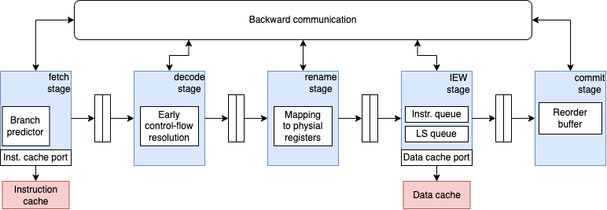

# Modeling Out-of-order (O3) CPU in GEM5 

## Architecture of GEM5 O3 processor 

* **Stages of execution (O3CPU pipeline in gem5):**

  * **Fetch**:
    The Fetch stage is responsible for bringing new instructions into the pipeline every cycle. It maintains the *fetch PC* for each active hardware thread and decides **which thread to fetch from** according to the selected SMT fetch policy (e.g., round-robin, IQ-based, etc.). During fetch, the front-end consults the **branch predictor** (BTB/indirect predictor/return stack, depending on configuration) to predict the next PC and keep the pipeline full. If a prediction is taken, Fetch redirects to the predicted target immediately; if prediction information is missing (e.g., BTB miss), Fetch typically falls back to sequential fetching until later correction. Fetch can be stalled by downstream back-pressure (e.g., if decode/rename buffers are full) or by I-cache/TLB latency, and it is also responsible for initiating pipeline flushes when the front-end must be redirected.

  * **Decode**:
    Decode transforms fetched instruction bytes into decoded micro-ops (or internal instruction representations) each cycle, placing them into decode/rename buffers. A key role of Decode is to handle **early control-flow resolution** for some simple cases—most notably **PC-relative unconditional branches**—so the pipeline can redirect quickly without waiting for execution. Decode also performs basic checks (e.g., instruction validity) and can become a bottleneck if its width is smaller than the fetch width or if complex instructions expand into multiple micro-ops. Like Fetch, Decode can stall if the next stage cannot accept more instructions.

  * **Rename**:
    Rename is where the CPU transitions from architectural to out-of-order execution by eliminating false register dependencies. Each instruction’s architectural registers are mapped to **physical registers** using a rename map, and new destination registers are allocated from a **free list** (physical register file management). Rename can stall if it cannot allocate enough physical registers (e.g., many instructions with destinations) or if downstream resources are saturated (e.g., ROB, IQ, LSQ limits). It also handles **serializing instructions** (such as barriers or instructions that must not be reordered): these instructions are allowed to enter the pipeline only when the back-end is in a safe state, often requiring the pipeline to “drain” so that earlier instructions complete/commit before the serializing instruction proceeds.

  * **Issue/Execute/Writeback (IEW)**:
    gem5 O3 merges these into one conceptual block because they are tightly coupled. First, instructions are **dispatched** into back-end structures such as the **Instruction Queue (IQ)** for scheduling and the **Load/Store Queue (LSQ)** for memory ordering. Then, ready instructions are **issued** when their operands are available and an appropriate functional unit is free. Issued instructions **execute** (possibly multi-cycle), and when results are produced, they are **written back** to the physical register file and broadcast to dependent instructions to wake them up. Memory operations interact with caches/TLBs and the LSQ to enforce ordering rules. This stage is typically where most of the out-of-order “performance magic” happens: instructions can execute as soon as they are ready, even if older instructions are still waiting on long-latency events (e.g., cache misses), as long as dependency and resource constraints permit.

  * **Commit**:
    Commit retires instructions **in program order** using the **Reorder Buffer (ROB)**, ensuring precise architectural state. Each cycle, it attempts to commit up to the configured commit width, updating the architectural register map and freeing physical registers that are no longer needed. Commit is also responsible for handling **faults/exceptions** in a precise manner: if an instruction triggers a fault, the pipeline is redirected appropriately and younger instructions are squashed. Importantly for branch prediction labs, Commit is where a **branch misprediction becomes architecturally visible**: when the correct branch outcome is known to be wrong-path, Commit (or the resolution mechanism tied to execution) triggers a squash/redirect that flushes incorrect speculative work and restarts Fetch at the correct target, while also updating predictor state.

* **Important feature:**
  **Execute-in-execute model:** In gem5’s O3CPU, the functional behavior of many operations is modeled as occurring when the instruction reaches **Execute** (within IEW), meaning results and dependency wakeups are produced at execute/writeback time rather than earlier. This fits the O3 design: instructions may sit in queues waiting to issue, and only once issued do they actually execute, produce results, and enable dependent instructions—making IEW the key stage for modeling timing, speculation, and the performance impact of branch prediction and memory latency.



## Configuration of O3 CPU model in gem5

We can model the O3 CPU in gem5 with configuration script, we provided, written in python. The configuration parameters can be divided into:

### Pipeline parameters

These parameters define the structure and behavior of the pipeline stages, such as fetch width, decode width, issue width, and commit width. They also include parameters for branch prediction, such as the size of the branch predictor and the number of entries in the branch target buffer

#### 1) CPU model and memory access bandwidth

`cacheLoadPorts` and `cacheStorePorts` limit how many load/store requests the core can send toward the cache hierarchy in parallel. Setting them high removes *port contention* as a bottleneck, so the lab results reflect **cache/TLB/LSQ behavior** rather than an artificial “only a few loads per cycle” restriction.

#### 2) Pipeline inter-stage delays (timing between stages)

They affect how quickly stalls and redirects propagate. This matters a lot for branch prediction labs: when a branch is resolved late, the redirect must travel back to Fetch, and these delays contribute to the **misprediction penalty** (how many wrong-path cycles you waste). Keeping most delays at 1 models a short pipeline; increasing them models deeper pipelines with larger penalties.


##### Feedback Paths (Backwards Communication)

These delays affect how quickly stalls, flushes, and redirects propagate backward in the pipeline.
They directly influence **branch misprediction penalty**.

| Parameter             | Meaning                                                                                             |
| --------------------- | --------------------------------------------------------------------------------------------------- |
| `decodeToFetchDelay`  | Cycles required for a signal to propagate from Decode back to Fetch.                                |
| `renameToFetchDelay`  | Latency for feedback from Rename to Fetch.                                                          |
| `iewToFetchDelay`     | Latency for feedback from Issue/Execute/Writeback (IEW) to Fetch.                                   |
| `commitToFetchDelay`  | Cycles required for Commit to redirect or stall Fetch (critical for branch misprediction recovery). |
| `renameToDecodeDelay` | Latency for feedback from Rename to Decode.                                                         |
| `iewToDecodeDelay`    | Latency for feedback from IEW to Decode.                                                            |
| `commitToDecodeDelay` | Latency for feedback from Commit to Decode.                                                         |
| `iewToRenameDelay`    | Latency for feedback from IEW to Rename.                                                            |
| `commitToRenameDelay` | Latency for feedback from Commit to Rename.                                                         |
| `commitToIEWDelay`    | Latency for control signals propagating from Commit to IEW.                                         |

---

##### Forward Paths (Instruction Flow)

These delays affect how long instructions take to move forward through the pipeline.

| Parameter             | Meaning                                                                          |
| --------------------- | -------------------------------------------------------------------------------- |
| `fetchToDecodeDelay`  | Latency for instructions traveling from Fetch to Decode.                         |
| `decodeToRenameDelay` | Latency for instructions traveling from Decode to Rename.                        |
| `renameToIEWDelay`    | Latency for instructions moving from Rename to IEW.                              |
| `issueToExecuteDelay` | Internal delay between issuing an instruction and starting execution within IEW. |
| `iewToCommitDelay`    | Latency for executed instructions to become visible to Commit.                   |
| `renameToROBDelay`    | Latency between Rename stage and insertion into the Reorder Buffer (ROB).        |

---

##### Special Timing Parameters

| Parameter          | Meaning                                                          |
| ------------------ | ---------------------------------------------------------------- |
| `trapLatency`      | Total latency (in cycles) to handle an exception or trap.        |
| `fetchTrapLatency` | Additional latency if a trap is detected during the Fetch stage. |

---


#### 4) Front-end throughput (Fetch/Decode)

`fetchWidth` and `decodeWidth` define the maximum number of instructions that can be fetched/decoded per cycle. If these widths are small, the front-end becomes a throughput bottleneck and can hide or exaggerate branch predictor effects.
`fetchBufferSize` and `fetchQueueSize` are buffering capacity between Fetch and Decode. Larger buffers reduce short-term stalls and help keep Decode busy even if Fetch experiences brief hiccups (e.g., I-cache latency or redirects).

#### 5) Rename, ROB and Register file

The Rename stage needs enough **ROB entries** and **physical registers** to keep instructions in-flight.

* `numROBEntries` controls the instruction window size (how much speculation/out-of-order work can be kept).
* `numPhysIntRegs` and `numPhysFloatRegs` control how well the core can rename registers to avoid false dependencies.
  If these are too small, Rename stalls, reducing the benefit of O3 execution and making branch predictor differences harder to see.

#### 6) Back-end throughput (Dispatch/Issue)

`dispatchWidth` controls how many decoded/renamed instructions can enter scheduling structures per cycle, while `issueWidth` controls how many ready instructions can begin execution per cycle. These two widths limit the peak throughput of the O3 back-end. For branch prediction labs, having a reasonable back-end width helps ensure performance changes are dominated by **control-flow accuracy** rather than an underpowered scheduler.

#### 7) Writeback and Memory (LSQ) Configuration

These parameters control how the O3 core handles **memory operations**, including writeback bandwidth, load/store buffering, dependency checking, and memory ordering.

* **`wbWidth`** defines how many instructions can write results back per cycle.
* **`LQEntries` / `SQEntries`** define the size of the Load Queue and Store Queue, limiting the number of in-flight memory operations.
* **Dependency checking parameters** (`LSQDepCheckShift`, `LSQCheckLoads`) control how aggressively the CPU checks load–store ordering violations.
* **Store-set predictor parameters** (`store_set_clear_period`, `LFSTSize`) configure memory dependency prediction.
* **`needsTSO`** enables strict Total Store Ordering (stronger memory model, typically reduces memory-level parallelism).

If needed, I can also provide a short comparison explaining how changing LQ/SQ sizes affects memory-level parallelism in experiments.


#### 8) Commit Stage Configuration

The **Commit stage** finalizes instruction execution and retires instructions in program order from the Reorder Buffer (ROB). It ensures precise exceptions and correct architectural state.

* **`commitWidth`** defines how many instructions can retire per cycle.
* **`squashWidth`** controls how many instructions can be flushed (squashed) per cycle during events such as branch mispredictions or exceptions.
* **`backComSize`** and **`forwardComSize`** define the size of time buffers used for backward and forward communication between pipeline stages. These buffers model inter-stage communication delays and affect how quickly redirects and stalls propagate through the pipeline.
                   
These parameters influence overall throughput and branch misprediction recovery behavior.


### Functional units

In order to define the functional units, we need to specify the types of operations that functional unit can perform. Following snippet shows how to define the functional units in the O3 CPU model and its number of instances. For example, the `CPU_FP_MultDiv` functional unit can perform floating-point multiplication, multiplication-accumulate, division, square root, and miscellaneous floating-point operations, with specified latencies and pipelining capabilities.:
```python
class CPU_FP_MultDiv(FP_MultDiv):
    opList = [
        OpDesc(opClass="FloatMult", opLat=8, pipelined=True),
        OpDesc(opClass="FloatMultAcc", opLat=8, pipelined=True),
        OpDesc(opClass="FloatDiv", opLat=4, pipelined=True),
        OpDesc(opClass="FloatSqrt", opLat=4, pipelined=True),
        OpDesc(opClass="FloatMisc", opLat=4, pipelined=True),
    ]
    count = 1
```

## Branch prediction (BPU)

The branch predictor object assigned to `the_cpu.branchPred` selects the **BPU implementation** (e.g., Tournament, TAGE, etc., depending on what’s compiled into your gem5 build). In branch prediction experiments you typically change this line and then observe changes in performance counters (mispredictions, IPC, squash rate). If you don’t set it, gem5 uses a default predictor.

Based on the search results from the gem5 repository, I can provide you with a comprehensive table of available branch predictors and an example of how to customize one.

### Available Branch Predictors in gem5

| Branch Predictor | Type | Description | Key Parameters |
|-----------------|------|-------------|----------------|
| **LocalBP** | Conditional | Simple 2-bit local predictor | `localPredictorSize` (2048), `localCtrBits` (2) |
| **TournamentBP** | Conditional | Tournament predictor combining local and global predictors (default for O3CPU) | `localPredictorSize` (2048), `globalPredictorSize` (8192), `choicePredictorSize` (8192) |
| **BiModeBP** | Conditional | Bi-mode predictor using global history | `globalPredictorSize` (8192), `choicePredictorSize` (8192) |
| **TAGE** | Conditional | TAgged GEometric history length predictor | `tage` (TAGEBase object), configurable history tables |
| **LTAGE** | Conditional | TAGE + Loop predictor | `tage` (LTAGE_TAGE), `loop_predictor` (LoopPredictor) |
| **TAGE-SC-L** | Conditional | TAGE with Statistical Corrector and Loop predictor | `tage`, `loop_predictor`, `statistical_corrector` |
| **TAGE-SC-L 8KB** | Conditional | 8KB variant of TAGE-SC-L | Budget: 8192*8 + 2048 bits |
| **TAGE-SC-L 64KB** | Conditional | 64KB variant of TAGE-SC-L | Larger configuration |
| **MultiperspectivePerceptronTAGE** | Conditional | Perceptron-based predictor with TAGE | `tage`, `loop_predictor`, `statistical_corrector` |
| **MultiperspectivePerceptronTAGE8KB** | Conditional | 8KB variant of Multiperspective Perceptron | Budget: 8192*8 + 2048 bits |
| **GshareBP** | Full BP | Gshare predictor (includes BTB/RAS) | `global_predictor_size` (512), `global_counter_bits` (2) |
| **SimpleIndirectPredictor** | Indirect | Indirect branch target predictor | `indirectSets` (256), `indirectWays` (2) |

---

### Example: How to Customize a Branch Predictor

Here's a complete example how to instantiate **LTAGE** predictor for an O3 CPU:

```python name=configs/example/custom_bp_example.py
from m5.objects.BranchPredictor import BranchPredictor, LTAGE

....
self.branchPred = BranchPredictor(conditionalBranchPred=LTAGE(numThreads=self.numThreads))
```


### Tips and Tricks

Using grep to find the specific metrics in the stats.txt file:
```bash
grep -ri "simSeconds" ./stats.txt && grep -ri "numCycles" ./stats.txt && grep -ri "cpi" ./stats.txt && grep -ri "numCycles" ./stats.txt 
```

